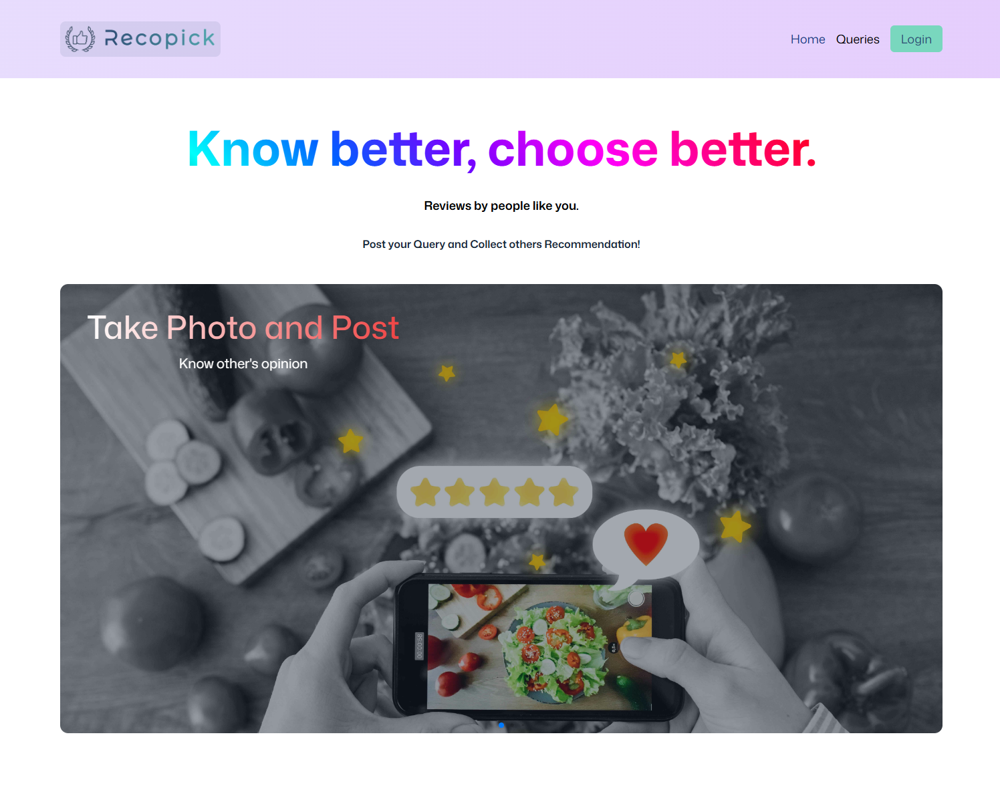

#  Recopick

A Product Recommendation platform for recommending products.

## Description
Recopick is a product recommendation platform that recommends products to users based on user's query on products.

## Backend Repository
[Recopick Backend](https://github.com/amirulkanak/recopick-product-review-backend)

## Key Features
- Users can Add/update/Delete their own Query about a product in The System
- Users can view other queries for alternative products on the Websites and see
the Details and other recommendations also.
- Users can Add recommendations also for certain products.
-Users can delete their recommendations.
- Users can Modify / Delete their comments also.

## Technologies
### MERN Stack

<p align="center">
  
  
  
  
</p>

  <div align="center">MongoDB - Express - React - Node</div>

## NPM Packages
- axios
- firebase
- JWT Authentication
- react-router-dom
- react-toastify
- framer-motion
- swipper
- react-icons
- sweetalert2

## Live Preview 
[Recopick](https://recopick-amirulkanak.web.app/)

## Screenshot
<div align='center'>
  
</div>

## Installation
1. Clone the repository frontend and backend repository -
[backend repository](https://github.com/amirulkanak/recopick-product-review-backend)
```bash
# frontend
git clone https://github.com/amirulkanak/recopick-product-review.git
# backend
git clone https://github.com/amirulkanak/recopick-product-review-backend.git
```
2. Install the dependencies
```bash
npm install
```
4. Create a .env.local file in the root directory and add the following
```env
# Firebase configuration
 VITE_FIREBASE_API_KEY=your-firebase-api-key
 VITE_FIREBASE_AUTH_DOMAIN=your-firebase-auth-domain
 VITE_FIREBASE_PROJECT_ID=your-firebase-project-id
 VITE_FIREBASE_STORAGE_BUCKET=your-firebase-storage-bucket
 VITE_FIREBASE_MESSAGING_SENDER_ID=your-firebase-messaging-sender-id
 VITE_FIREBASE_APP_ID=your-firebase-app-id

 # Backend API URL
  VITE_BACKEND_API_URL=your-backend-api-url
 ```
3. Run the project
```bash
npm run dev
```

## Contributing
Contributions are welcome! Feel free to submit issues and pull requests.

## Contact
for any queries - [coder.kanak@gmail.com](mailto:coder.kanak@gmail.com)